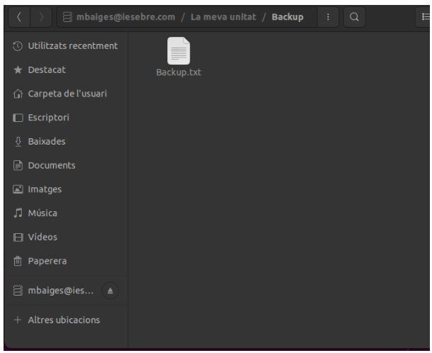

# CAS1

## Index:

1. Perquè penseu que aquesta és una bona solució al nostre problema?	
2. El pressupost mensual i anual de la despesa del servei a contractar.
3. Pressupost Mensual	
4. Preu anual
5. Creació de carpeta backup
6. Carpeta compartida
7. Exemples d’ús de consultar un document per part de l’usuari/a

## Descripció

Com a encarregat/da del departament d’informàtica de la teva empresa tens la obligació de fer les còpies de seguretat de la documentació de l’empresa, actualment les fas en una màquina local situada a les mateixes oficines on està l’empresa. La setmana passada el disc dur que feies servir per fer les còpies de seguretat es va negar a funcionar i s’ha perdut tota la informació que hi havia acumulada. No ha passat res perquè la documentació la guarden els treballadors i treballadores en local també, però una suor freda t’ha recorregut el cos… 

## Perquè penseu que aquesta és una bona solució al nostre problema?

Creiem que es una bona solució, perquè així si algun dia perdem els arxius ja sigui per culpa de que se'ns ha trencat el pc o tingui alguna mena de virus i el tinguéssim de restablir no perdem tots els arxius solament caldrà entrar al nostre compte de Drive i podrem restaurar desde la copia de seguretat feta tots els arxius.

Com a encarregat/da del departament d’informàtica de la teva empresa tens la obligació de fer les còpies de seguretat de la documentació de l’empresa, actualment les fas en una màquina local situada a les mateixes oficines on està l’empresa. La setmana passada el disc dur que feies servir per fer les còpies de seguretat es va negar a funcionar i s’ha perdut tota la informació que hi havia acumulada. No ha passat res perquè la documentació la guarden els treballadors i treballadores en local també, però una suor freda t’ha recorregut el cos… 

## El pressupost mensual i anual de la despesa del servei a contractar.

### Pressupost Mensual:

### Preu anual:

## Creació de carpeta backup

En aquesta carpeta guardarem les còpies de seguretat, per lo tant tots els arxius de l’empresa, sol tindrà accés l’administrador
 
Primer que res caldrà activar el nostre compte de Drive al Ubuntu 
Per poder fer això anirem a paràmetres hi ha comptes en línia 

Ara si anem a fitxers tindrem la nostra Unitat del Drive, i podrem crear una nova carpeta amb el nom de Backup

